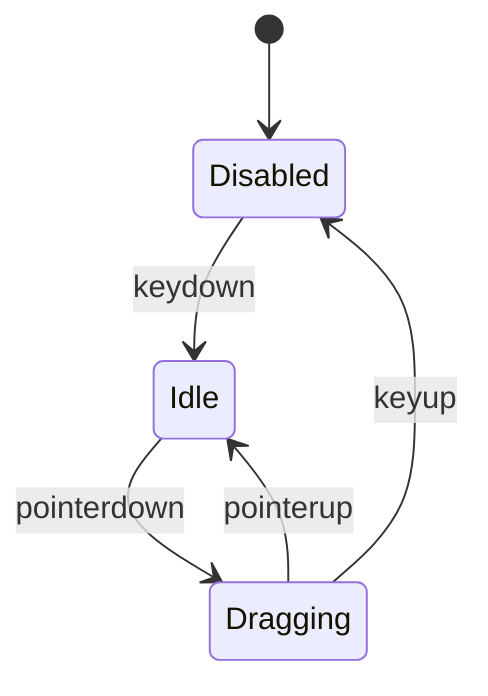
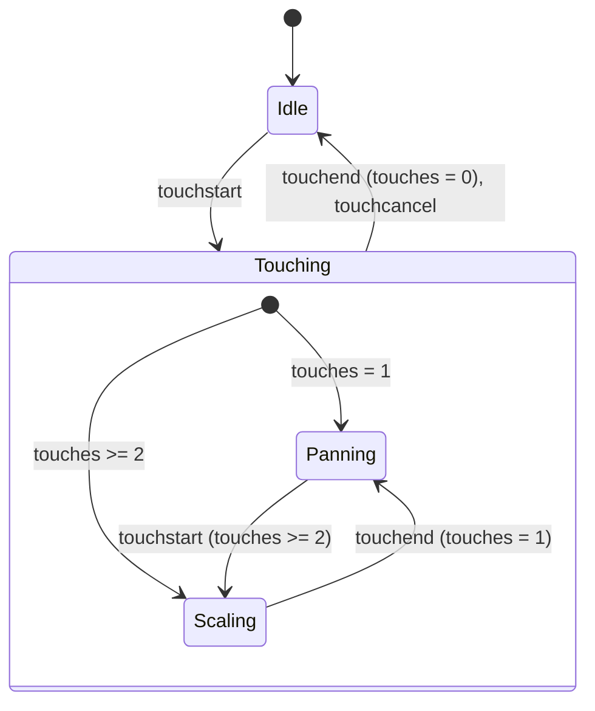

# FrameCanvas internals

## <kbd>Space</kbd> key drag mode state machine

In `Dragging` state, pointer movements cause viewport pan.

## Touch gesture state machine

In `Panning` state, touch movements cause viewport pan.

In `Scaling` state, touch movements cause viewport scaling.
Scaling factor depends on distance between touch points.

